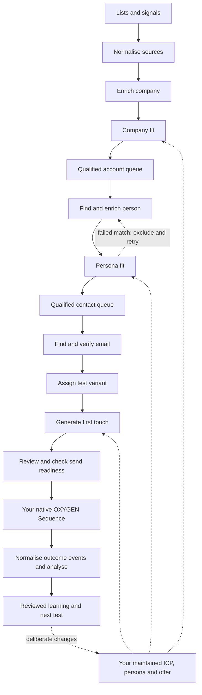

# GTM Architecture Template

Fork this repo. Edit your ICP and offer. Install the functions into OXYGEN. Inspect one account before running a batch.

This kit contains **13 editable function templates**: seven callable tables for research, scoring, contact lookup and copy; six deterministic workflows for source intake, prioritisation, experiment assignment, send readiness and results. Execution and row state live in OXYGEN. Local JavaScript builds definitions and tests the pure functions.

## Start here

Requires Node.js 22+ and an OXYGEN account. Install the [OXYGEN CLI](https://oxygen-agent.com/docs/quickstart) and log in:

```sh
npm install -g @oxygen-agent/cli
oxygen login
git clone https://github.com/timscheuerai/gtm-architecture-template.git
cd gtm-architecture-template
npm run build
npm test
npm run setup                 # shows the workspace and resources to create
npm run setup -- --apply      # installs them; runs no paid function
```

Use `OXYGEN_BIN=oxygen-dev` or append `--cli oxygen-dev` to the setup/example/preview commands when working in dev. Authentication stays in your CLI profile; no API keys belong in this repo.

Try a function with a supplied input:

```sh
npm run preview -- --function assign_test_variant
npm run preview -- --function prioritise_contacts
npm run preview -- --function prepare_sequence
```

These run the saved deterministic workflows in OXYGEN's `dry_run` mode. Inspect the returned run with `oxygen workflows run <run_id> --json`. The send-readiness example is intentionally unreviewed and returns `ready: false`.

Then inspect the scoring prompt against ten **synthetic** companies:

```sh
npm run example -- --function score_company_icp
npm run preview -- --function score_company_icp
```

The example command inserts fixture rows into the function's backing table; the preview renders the first row's prompt and estimates its cost. Expected scores are in [examples/score_company_icp.expected.json](examples/score_company_icp.expected.json). A preview does not call the model or prove score quality. Replace the synthetic inputs with ten companies you know before a live calibration.

## The functions

| Function | Implementation | Output |
|---|---|---|
| `normalise_sources` | Deterministic workflow | Unique company domains, preserved signals, rejected inputs |
| `enrich_company` | Research callable | Cited firmographics and explicit gaps |
| `score_company_icp` | AI callable | Company fit score, reason, disqualification and gaps |
| `prioritise_accounts` | Deterministic workflow | Qualified research queue within capacity |
| `find_person` | Research callable | One current candidate, with exclusion support for retries |
| `enrich_person` | Research callable | Current role, remit, evidence and gaps |
| `score_persona_icp` | AI callable | Persona fit score and reasons |
| `prioritise_contacts` | Deterministic workflow | Contacts passing both gates, within capacity |
| `enrich_contact_details` | Native enrichment callable | Work-email waterfall result, with verification |
| `assign_test_variant` | Deterministic workflow | Stable account-level A/B assignment and version IDs |
| `generate_first_touch` | AI callable | One draft using the assigned copy variant |
| `prepare_sequence` | Deterministic workflow | Send-readiness decision and handoff fields |
| `analyse_results` | Deterministic workflow | Deduplicated delivered/replied/booked rates per cohort |

Every function has an editable [definition](functions), an [example input](examples), and declared inputs/outputs. AI and research functions also have [prompt files](prompts). The email function resolves current native provider definitions through the CLI during installation; phone lookup is an optional additional capability, not installed by default.

## How they fit together



These are composable functions, not a pre-armed outbound campaign. The diagram shows the intended composition; installing the kit does not connect every stage, attach a sender, enrol contacts, or arm a schedule. [Compose a motion](docs/composition.md) explains the mappings and the native Sequence handoff.

## Customise it

1. Write your company and persona rubrics using [company/](company). Keep your private company knowledge in your own workspace or `company/private/` (ignored by Git).
2. Edit prompts and JSON contracts under `functions/` and `prompts/`. Run `npm run build && npm test`.
3. Copy `config.example.json`, choose a unique `prefix`, and pass `--config your-config.json` to setup, example and preview. Use a new prefix to install a changed version alongside the previous one.
4. Freeze a test plan using [experiment.example.json](company/experiment.example.json). The shipped assignment function supports two copy variants. Company/persona cohort tests need deliberate cohort labels; they are not randomised experiments.

The priority policy is explicit: 70% fit and 30% freshness-adjusted intent. Change the source if that is wrong for your motion. Company and persona scores must independently pass before contact lookup; intent cannot rescue failed fit.

## Live runs and delivery

Setup creates definitions only. To run a paid callable, bind it to your working table, inspect a one-row dry run, then run that exact row with your chosen credit ceiling. [Composition examples](docs/composition.md) show the commands. The default callable ceiling is a limit, not a price estimate.

Sending belongs to an OXYGEN Sequence: cadence, suppression, reply stops and limits are enforced there. `prepare_sequence` is an additional check, not a replacement for the Sequence's current checks or authorization. `analyse_results` returns descriptive evidence for review; it never rewrites the ICP or declares a statistically significant winner.

## Portable assets and validation

- [blueprints/functions.json](blueprints/functions.json): six table definitions and six disabled workflow graphs. Preflight with `oxygen blueprints preflight --file blueprints/functions.json --json`. The recommended setup script also registers the callables and creates the current email-waterfall definition.
- [workflows/](workflows): individually editable and importable deterministic graphs, generated from the function source.
- [Validation record](docs/validation.md): what was checked against dev and what still requires a live pilot.

MIT licensed. Built by [Tim Scheuer](https://github.com/timscheuerai).
